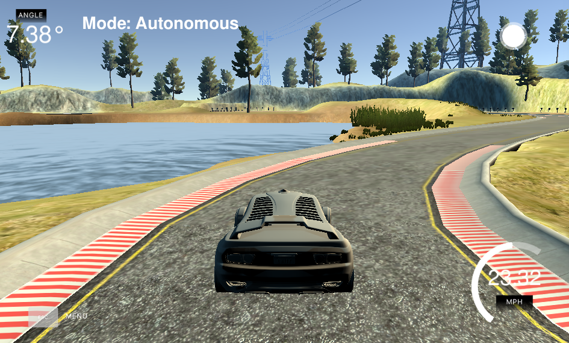
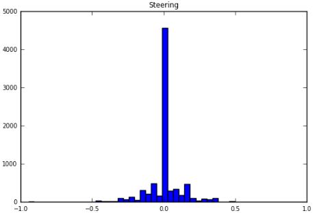
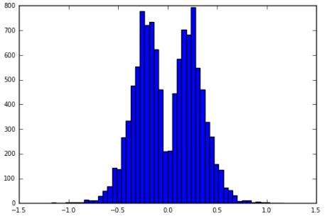
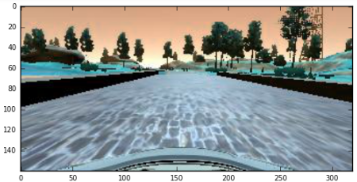
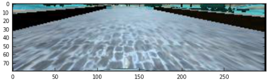

# Behaviour Cloning

#### Video output: 

#### To run the simulation:
1) Activate conda environment with Tensor Flow libraries or use an apropriate docker image
   a) conda environment
    Follow instructions from 
   b) docker image
   docker pull udacity/carnd-term1-starter-kit
   docker run -it --rm -p 4567:4567 -v ~/Udacity_Self_Driving_Car_ND/Term1/Behavorial_Cloning:/src udacity/carnd-term1-starter-kit /bin/bash
   
2) Start the simulator on autonomous mode track 1 and then run:
   python drive.py model.json
-----------------------------------------------------------------------------------------------------------------------

# The problem

we are trying to develop an end-to-end control system using a deep neural network to control the steering of a simulated vehicle. The simulation environment includes a closed loop track with left and right turns, lanes, bridge, escape exits, trees, edges and other.
The viewpoint is taken from a simulated camera placed centered on top of the vehicle.
The objective is to develop a suitable architecture with a trained model which is able to drive the car on the track without ever going off the road.

# Proposed solution

The architecture adopted for solving this problem was similar to the solution presented by Bojarski, Mariusz, et al [1]. Here, as in that paper we aim to build an end-to-end control system by using camera images directly as input and getting steering values as an output. The authors proved that it was possible to build a system which solves this problem in real life, using cameras mounted on top of the vehicle and gathering a lot of data to train an adequate model.

It is worth to mention that they used aditional cameras on the left and right together with the centered one in order to augment the data. Their strategy proved to be very successful, otherwise it would be extremely time consuming (and probably not even feasible) to get a relevant amount of data to train the neural network.

The proposed architecture consists of 5 Convolutional Neural Networks followed by 3 Dense Neural Networks as follows:

Input size: 80 , 160 , 3
_________________________________________________________________________________________________
Layer (type)                     Output Shape          Param #     Connected to                     
====================================================================================================
lambda_11 (Lambda)               (None, 80, 300, 3)    0           lambda_input_11[0][0]            
____________________________________________________________________________________________________
convolution2d_50 (Convolution2D) (None, 38, 148, 24)   1824        lambda_11[0][0]                  
____________________________________________________________________________________________________
batchnormalization_52 (BatchNorm (None, 38, 148, 24)   48          convolution2d_50[0][0]           
____________________________________________________________________________________________________
activation_80 (Activation)       (None, 38, 148, 24)   0           batchnormalization_52[0][0]      
____________________________________________________________________________________________________
convolution2d_51 (Convolution2D) (None, 17, 72, 36)    21636       activation_80[0][0]              
____________________________________________________________________________________________________
batchnormalization_53 (BatchNorm (None, 17, 72, 36)    72          convolution2d_51[0][0]           
____________________________________________________________________________________________________
activation_81 (Activation)       (None, 17, 72, 36)    0           batchnormalization_53[0][0]      
____________________________________________________________________________________________________
convolution2d_52 (Convolution2D) (None, 7, 34, 48)     43248       activation_81[0][0]              
____________________________________________________________________________________________________
batchnormalization_54 (BatchNorm (None, 7, 34, 48)     96          convolution2d_52[0][0]           
____________________________________________________________________________________________________
activation_82 (Activation)       (None, 7, 34, 48)     0           batchnormalization_54[0][0]      
____________________________________________________________________________________________________
convolution2d_53 (Convolution2D) (None, 5, 32, 64)     27712       activation_82[0][0]              
____________________________________________________________________________________________________
batchnormalization_55 (BatchNorm (None, 5, 32, 64)     128         convolution2d_53[0][0]           
____________________________________________________________________________________________________
activation_83 (Activation)       (None, 5, 32, 64)     0           batchnormalization_55[0][0]      
____________________________________________________________________________________________________
convolution2d_54 (Convolution2D) (None, 3, 30, 64)     36928       activation_83[0][0]              
____________________________________________________________________________________________________
batchnormalization_56 (BatchNorm (None, 3, 30, 64)     128         convolution2d_54[0][0]           
____________________________________________________________________________________________________
activation_84 (Activation)       (None, 3, 30, 64)     0           batchnormalization_56[0][0]      
____________________________________________________________________________________________________
flatten_11 (Flatten)             (None, 5760)          0           activation_84[0][0]              
____________________________________________________________________________________________________
fc1 (Dense)                      (None, 100)           576100      flatten_11[0][0]                 
____________________________________________________________________________________________________
batchnormalization_57 (BatchNorm (None, 100)           200         fc1[0][0]                        
____________________________________________________________________________________________________
activation_85 (Activation)       (None, 100)           0           batchnormalization_57[0][0]      
____________________________________________________________________________________________________
dropout_30 (Dropout)             (None, 100)           0           activation_85[0][0]              
____________________________________________________________________________________________________
fc2 (Dense)                      (None, 50)            5050        dropout_30[0][0]                 
____________________________________________________________________________________________________
batchnormalization_58 (BatchNorm (None, 50)            100         fc2[0][0]                        
____________________________________________________________________________________________________
activation_86 (Activation)       (None, 50)            0           batchnormalization_58[0][0]      
____________________________________________________________________________________________________
dropout_31 (Dropout)             (None, 50)            0           activation_86[0][0]              
____________________________________________________________________________________________________
fc3 (Dense)                      (None, 10)            510         dropout_31[0][0]                 
____________________________________________________________________________________________________
batchnormalization_59 (BatchNorm (None, 10)            20          fc3[0][0]                        
____________________________________________________________________________________________________
activation_87 (Activation)       (None, 10)            0           batchnormalization_59[0][0]
____________________________________________________________________________________________________
output (Dense)                   (None, 1)             11          activation_87[0][0]      
====================================================================================================
Total params: 713811

Dropout layers were included to prevent over-fitting and increase robustness. Relu units were used throughout the neural network architecture in order to make the system compatible with non-linearities and thus able to represent more complex systems. Batch normalisation layers were included before activation units in order to speed up the convergence process when training the neural network.

# Augmenting the original dataset

The original dataset provided by Udacity was used to train the neural network.
When running an initial experiment using all the dataset, the trained model was driving the car off the road. 
After a careful and detailed analysis of the dataset, it was realised that there were too many samples centred around steering = 0 and too few at extreme regions (-1.0 and 1).

The key method to make the car stay on the track was to remove the excess of training data in the centre region and add copies of data at extreme regions, by shifting the images captured by the center camera both to the left and to the right and correcting the steering accordingly.
The images were also reduced to half the size in order to make the training steps faster and normalised between -0.5 and 0.5.

All images were cropped in order to eliminate useless information (car and sky) which also contributes to speed up the training process.

The original dataset comprised 8036 color images with size 320x160. The final dataset comprised 11174 color images with size 300x80.
The distribution of the samples is much broader in the new set compared to the original one which means that training is much more effective.

# Conclusion

In the end 28 epochs were enough to train (under two minutes!) a model which is able to make the car stay on track.

This architecture proved to be adequate for the given problem and has the main advantages of being simple, small and easy to train in very few steps and with a relatively small dataset.

Note: I decided not to augment the dataset by using left and right camera images because that introduces unpredictable and artificial biases which may lead to misbehaviours as the paper authors also mention. Besides, by shifting the center image we achieve roughly the same result (as using the left and righ cameras). 

This model solves the given problem and successfully maintains the car on the track even when running at full speed.

References:
[1] “Bojarski, Mariusz, et al. "End to End Learning for Self-Driving Cars." arXiv preprint arXiv:1604.07316 (2016).
